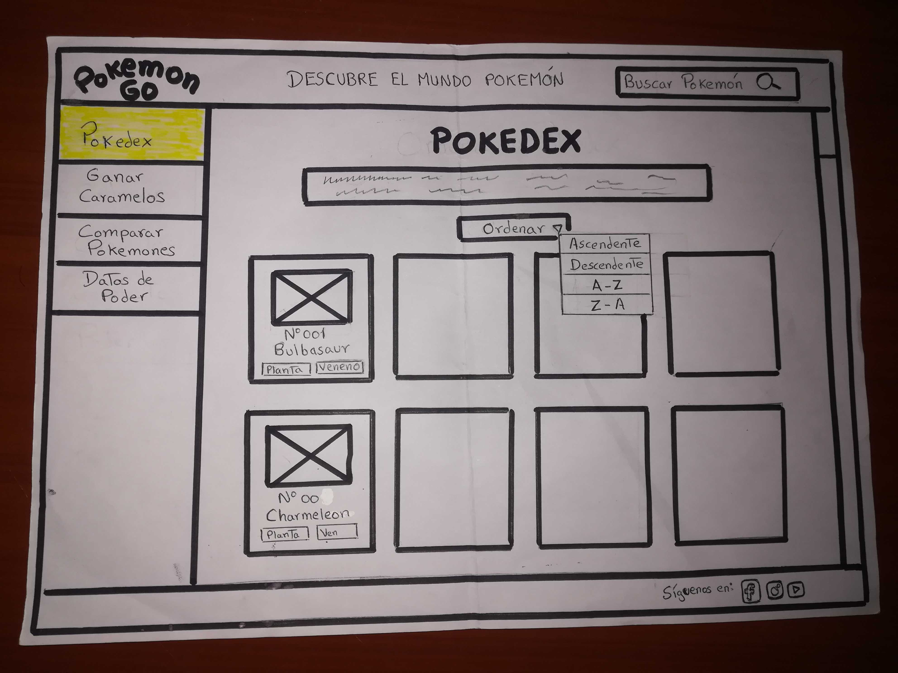
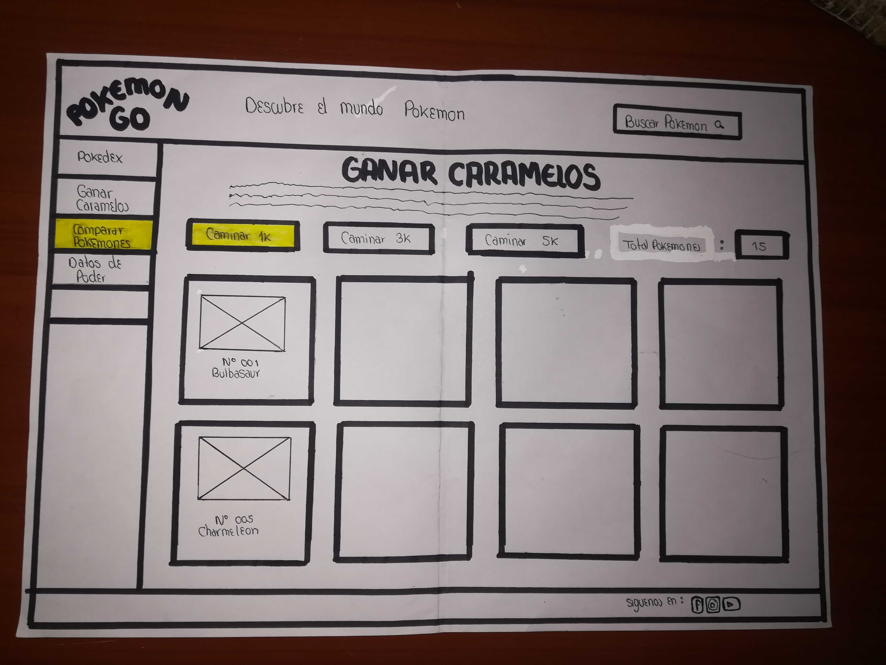
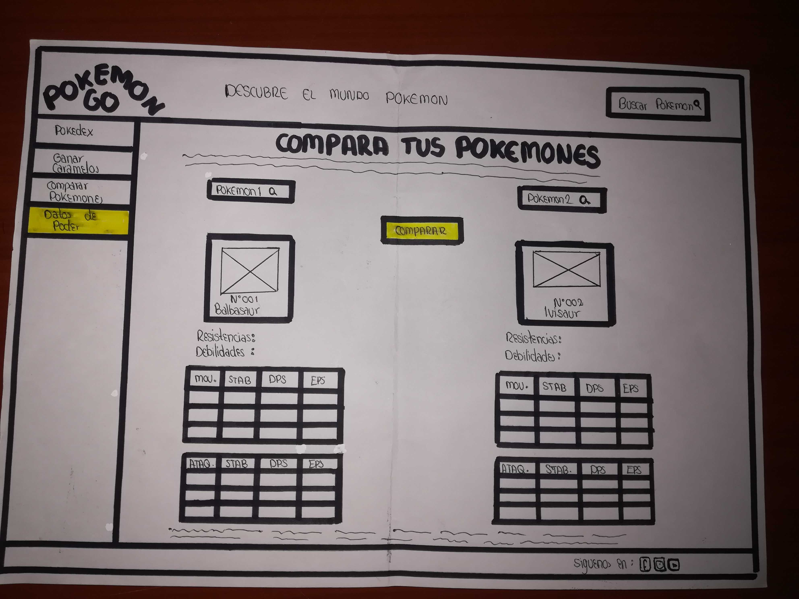
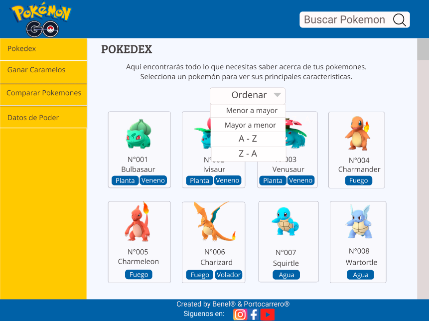
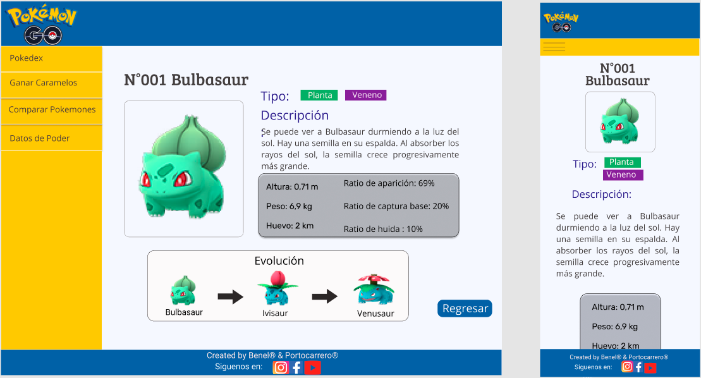
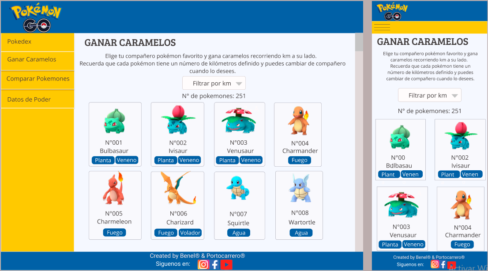
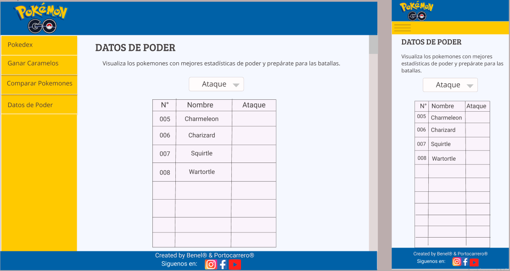
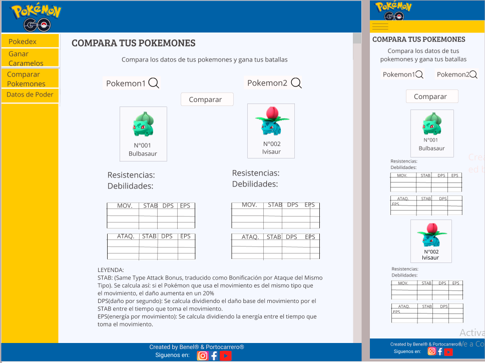

# Data Lovers

## Índice

* [Presentación de Proyecto Pokemon Go](#0-presentación-proyecto)
* [1. Preámbulo](#1-preámbulo)
* [2. Resumen del proyecto](#2-resumen-del-proyecto)
* [3. Objetivos de aprendizaje](#3-objetivos-de-aprendizaje)
* [4. Consideraciones generales](#4-consideraciones-generales)
* [5. Criterios de aceptación mínimos del proyecto](#5-criterios-de-aceptación-mínimos-del-proyecto)
* [6. Hacker edition](#6-hacker-edition)
* [7. Consideraciones técnicas](#7-consideraciones-técnicas)
* [8. Pistas, tips y lecturas complementarias](#8-pistas-tips-y-lecturas-complementarias)
* [9. Checklist](#9-checklist)

***
## Presentación de Proyecto Pokemon Go

### Definición del producto

Este proyecto es un sitio web dirigido a usuarios que están iniciando en el mundo virtual del juego Pokemon Go, es una página web que brinda a los usuarios la posibilidad de realizar diferentes interacciones de forma sencilla y rápida para poder conocer las principales caraterísticas y datos de los pokemones mediante acciones como búsquedas, filtros, ordenado y cálculos basados en una importante data sobre cada uno de los pokemones; en base esta información los usuarios podrán conocer mejor, hacer capturas y escoger a los pokemones para sus batallas.

### Historias de usuario

## Historia de usuario N°1: 
Descripción: Yo como jugador de Pokemon Go quiero visualizar a todos los pokemones para poder conocerlos.
Criterios de Aceptación:
- El usuario al acceder a la pagina podrá visualizar a todos los pokemones
- El usuario podrá ver su foto, su nombre y el tipo del pokemón.
- La página estará publicada y se podrá visualizar en cualquier dispositivo.

## Historia de usuario N°2: 
Descripción: Yo como usuario quiero ordenar por orden nombre(A-Z / Z-A) a mis pokemones para poder ubicarlos.
Criterios de Aceptación:
- El usuario al hacer click en el botón de ordenar se desplegará una serie de opciones(filtrar de A-Z, Z-A, ascendente, descendente)
- El usuario al elegir una opción podrá ver que se ordena según sea lo que haya elegido en caso sea A-Z o Z-A podrá ver que se ordena por el nombre o si ha elegido que se orden ascendente o descendente se ordenará por el id
- La página estará publicada y se podrá visualizar en cualquier dispositivo (desktop,tablet y celular).

## Historia de usuario N°3: 
Descripción: Yo como usuario quiero ordenar por su numero a mis pokemones para poder ubicarlos de manera mas rápida.
Criterios de Aceptación: 
- El usuario al hacer click en el botón de ordenar se desplegará una serie de opciones(filtrar de manera ascendente y descendente)
- El usuario al elegir una opción podrá ver que se ordena según sea lo que haya elegido, que se orden ascendente o descendente se ordenará por el id.
- La página estará publicada y se podrá visualizar en cualquier dispositivo (desktop,tablet y celular).

## Historia de usuario N°4: 
Descripción: Yo como usuario quiero conocer la distancia que debo caminar con un pokemón para obtener caramelos.
Criterios de Aceptación:
- El usuario podrá hacer click en el botón de ganar caramelos que le mostrará una lista de opciones según lo que debe caminar con el acompañante para ganar los caramelos(1k, 3k, 5k, 10k)
- El usuario al hacer click en una opción solo le mostrará los nombres, id, imagen y tipo de los pokemones que pertenecen a esa distancia
- La información será adaptable a cualquier dispositivo(desktop,tablet y celular).

## Historia de usuario N°5,6,7,8,9: 
Descripción: Yo como usuario quiero ordenar de mayor a menor los datos de poder (ataque, defensa, salud, max Hp y max CP) de los pokemones para poder ver cual es mi mejor opción para mis batallas.
Criterios de Aceptación:
- El usuario al hacer click en la opción "Datos de poder" de la lista de filtros podrá visualizar una pantalla con 5 botones entre ellos debe hacer click en "atake" para poder ordemar de mayor a menor atake a los pokemones
- El usuario al hacer click en el boton podrá visualizar los pokemones.
- La información debe ser (responsive) adaptable a cualquier dispositivo (desktop,tablet y celular).

## Historia de usuario N°10: 
Descripción: Yo como usuario quiero buscar a mi pokemón por su nombre para poder ubicarlo dentro del total de pokemones.
Criterios de Aceptación:
- El usuario podrá visualizar en la parte superior un input "buscar pokemon"
- El usuario al hacer click sobre la caja de búsqueda podrá ingresar algunas letras y obtendrá sugerencias sobre el pokemón que está buscando.
- El usuario al seleccionar un nombre podrá ubicar al pokemon que está buscando.
- La página estará publicada y se podrá visualizar en cualquier dispositivo(desktop,tablet y celular).

## Historia de usuario N°11: 
Descripción: Yo como usuario quiero seleccionar a un pokemón para poder conocer sus características.
Criterios de Aceptación:
- El usuario al hacer click sobre la imagen del pokemon podrá visualizar  en una nueva pantalla las características básicas del pokemon(imagen, nombre, id, tipo, altura, peso, caramelos y los kilómetros que debes caminar con el huevo).
- La información será adaptable a cualquier tipo de dispositivo.

## Historia de usuario N°12: 
Descripción: Yo como usuario quiero comparar los datos de combate(Debilidades, resistencias, STAB, DPS, EPS)entre dos pokemones para poder elegir el mas apropiado para cada batalla.
Criterios de Aceptación:
- El usuario al hacer click en la opción de "Combate" podrá comparar entre dos pokemones, para ello deberá realizar dos filtros: Seleccionar el tipo de pokemon y luego seleccionar el nombre del pokemon.
- Al hacer click en el botón comparar podrá visualizar los siguientes datos: Imágen del pokemón, id, nombre, debilidades,resistencias.
- El usuario al hacer click  en el botón "Ver ataques y movimientos" podrá visualizar información detallada sobre los siguientes datos: STAB,DPS,EPS.
- La página estará publicada y se podrá visualizar en cualquier dispositivo.

## Definición de terminado de las historias de Usuario:
- El código cumple con la guía de estilos acordada en el prototipo.
- La historia implementada ha sido testeada con al menos 3 usuarios y se han incorporado las mejoras identificadas.
- El código ha pasado los tests necesarios.
- El diseño ha sido realizado con la técnica de diseño web responsive para una correcta visualización en cualquier dispositivo.
- El código esta desplegado en gh-pages

#### Prototipo de baja fidelidad







#### Prototipo de alta fidelidad








## 1. Preámbulo

Según [Forbes](https://www.forbes.com/sites/bernardmarr/2018/05/21/how-much-data-do-we-create-every-day-the-mind-blowing-stats-everyone-should-read),
el 90% de la data que existe hoy ha sido creada durante los últimos dos años.
Cada día generamos 2.5 millones de terabytes de datos, una cifra sin
precedentes.

No obstante, los datos por sí mismos son de poca utilidad. Para que esas
grandes cantidades de datos se conviertan en **información** fácil de leer para
los usuarios, necesitamos entender y procesar estos datos. Una manera simple de
hacerlo es creando _interfaces_ y _visualizaciones_.

En la siguiente imagen, podrás ver cómo con la data que que se ve en la parte
izquierda se puede construir una interfaz amigable y entendible por el usuario
al lado derecho.


## 2. Resumen del proyecto

En este proyecto **construirás una _página web_ para visualizar un
_conjunto (set) de datos_** que se adecúe a lo que descubras que tu usuario
necesita.

Como entregable final tendrás una página web que permita **visualizar la data,
filtrarla, ordenarla y hacer algún cálculo agregado**. Con cálculo agregado
nos referimos a distintos cálculos que puedes hacer con la data para mostrar
información aún más relevante para los usuarios (promedio, el valor máximo
o mínimo, etc).

Esta vez te proponemos una serie de datos de diferentes _temáticas_ para que
explores y decidas con qué temática te interesa trabajar. Hemos elegido
específicamente estos sets de datos porque creemos que se adecúan bien a esta
etapa de tu aprendizaje.

Una vez que definas tu área de interés, buscar entender quién es tu usuario
y qué necesita saber o ver exactamente; luego podrás construir la interfaz que
le ayude a interactuar y entender mejor esos datos.

Estos son datos que te proponemos:

* [Pokémon](src/data/pokemon/pokemon.json):
  En este set encontrarás una lista con los 251 Pokémon de la región de Kanto
  y Johto, junto con sus respectivas estadísticas usadas en el juego
  [Pokémon GO](http://pokemongolive.com).
   - [Investigación con jugadores de Pokémon Go](/src/data/pokemon/README.md)

* [League of Legends - Challenger leaderboard](src/data/lol/lol.json):
  Este set de datos muestra la lista de campeones en una liga del
  juego League of Legends (LoL).
   - [Investigación con jugadores de LoL](/src/data/lol/README.md)

* [Atletas Olímpicos](src/data/atletas/atletas.json).
  Este set nos proporciona la lista de los atletas que ganaron medallas en las
  olímpiadas de invierno y verano del siglo XXI.
   - [Investigación con interesados en atletas olímpicos](/src/data/atletas/README.md)

<!---
¡Too much information para comenzar (Diego)!
Una opción serían cálculos estadísticos como el promedio, el máximo o el mínimo,
por ejemplo, si tenemos una colección que representa a un grupo de personas,
y cada persona está representada como un _objeto_ con una _propiedad_ `altura`,
podríamos elegir calcular la altura promedio en el grupo entre otras cosas.
--->

## 3. Objetivos de aprendizaje

El objetivo principal de este proyecto es que, entendiendo las necesidades de
tus usuarios, aprendas a diseñar y construir una interfaz web donde se pueda
visualizar y manipular data.

Revisa la lista y reflexiona sobre los objetivos que conseguiste en el
proyecto anterior. Piensa en eso al decidir tu estrategia de trabajo individual
y de equipo.

### UX

- [X] Diseñar la aplicación pensando y entendiendo al usuario.
- [X] Crear prototipos para obtener _feedback_ e iterar.
- [X] Aplicar los principios de diseño visual (contraste, alineación, jerarquía).
- [X] Planear y ejecutar _tests_ de usabilidad.

### HTML y CSS

- [X] Entender y reconocer por qué es importante el HTML semántico.
- [X] Identificar y entender tipos de selectores en CSS.
- [X] Entender como funciona `flexbox` en CSS.
- [X] Construir tu aplicación respetando el diseño planeado (maquetación).

### DOM

- [X] Entender y reconocer los selectores del DOM (`querySelector` | `querySelectorAll`).
- [X] Manejar eventos del DOM. (`addEventListener`)
- [X] Manipular dinámicamente el DOM. (`createElement`, `appendchild`, `innerHTML`, `value`)

### Javascript

- [X] Manipular arrays (`filter` | `map` | `sort` | `reduce`).
- [X] Manipular objects (key | value).
- [X] Entender el uso de condicionales (`if-else` | `switch`).
- [X] Entender el uso de bucles (`for` | `forEach`).
- [X] Entender la diferencia entre expression y statements.
- [X] Utilizar funciones (`parámetros` | `argumentos` | `valor de retorno`).
- [X] Entender la diferencia entre tipos de datos atómicos y estructurados.
- [X] Utilizar ES Modules (`import` | `export`).

### Pruebas Unitarias (_testing_)
- [X] Testear funciones (funciones puras).

### Git y GitHub
- [X] Ejecutar comandos de git (`add` | `commit` | `pull` | `status` | `push`).
- [X] Utilizar los repositorios de GitHub (`clone` | `fork` | `gh-pages`).
- [X] Colaborar en Github (`pull requests`).

### Buenas prácticas de desarrollo
- [X] Organizar y dividir el código en módulos (Modularización).
- [X] Utilizar identificadores descriptivos (Nomenclatura | Semántica).
- [X] Utilizar linter para seguir buenas prácticas (ESLINT).

## 4. Consideraciones generales

* Este proyecto se debe resolver en duplas.
* El proyecto será entregado subiendo tu código a GitHub (commit/push) y la
  interfaz será desplegada usando [GitHub Pages](https://pages.github.com/).
* Tiempo para completarlo: Toma como referencia 4 semanas.

## 5. Criterios de aceptación mínimos del proyecto

Los criterios para considerar que has completado este proyecto son:

### Definición del producto

Documenta brevemente tu trabajo en el archivo `README.md` de tu repositorio,
contándonos cómo fue tu proceso de diseño y cómo crees que el producto resuelve
el problema (o problemas) que tiene tu usuario.

### Historias de usuario

Una vez que entiendas las necesidades de tus usuarios, escribe las [Historias
de Usuario](https://es.wikipedia.org/wiki/Historias_de_usuario) que representen
todo lo que el usuario necesita hacer/ver. Las **Historias de Usuario** deben
ser el resultado de tu proceso de investigación o _research_ de tus usuarios.

Asegúrate de incluir la definición de terminado (_definition of done_) y los
Criterios de Aceptación para cada una.

En la medida de lo posible, termina una historia de usuario antes de pasar
a la siguiente (Cumple con Definición de Terminado + Criterios de Aceptación).

### Diseño de la Interfaz de Usuario

#### Prototipo de baja fidelidad

Durante tu trabajo deberás haber hecho e iterado bocetos (_sketches_) de tu
solución usando papel y lápiz. Te recomendamos tomar fotos de todas las
iteraciones que hagas, que las subas a tu repositorio y las menciones en tu
`README.md`.

#### Prototipo de alta fidelidad

Lo siguiente es diseñar tu Interfaz de Usuario (UI por sus siglas en inglés -
_User Interface_). Para eso debes aprender a utilizar alguna herramienta de
diseño visual. Nosotros te recomendamos [Figma](https://www.figma.com/) que es
una herramienta que funciona en el navegador y, además, puedes crear una cuenta
gratis. Sin embargo, eres libre de utilizar otros editores gráficos como
Illustrator, Photoshop, PowerPoint, Keynote, etc. Recuerda utilizar la
[identidad gráfica](https://drive.google.com/open?id=1eeWFqrWpy-OYOH4EHDckFGunyrm9iNeE)
correspondiente a cada set de datos que elijas.

El diseño debe representar el _ideal_ de tu solución. Digamos que es lo que
desearías implementar si tuvieras tiempo ilimitado para trabajar. Además, tu
diseño debe seguir los fundamentos de _visual design_.

#### Testeos de usabilidad

Durante el reto deberás hacer _tests_ de usabilidad con distintos usuarios, y
en base a los resultados, deberás iterar tus diseños. Cuéntanos
qué problemas de usabilidad detectaste a través de los _tests_ y cómo los
mejoraste en tu propuesta final.

### Implementación de la Interfaz de Usuario (HTML/CSS/JS)

Luego de diseñar tu interfaz de usuario deberás trabajar en su implementación.
**No** es necesario que construyas la interfaz exactamente como la diseñaste.
No tienes tiempo ilimitado para trabajar, así es que deberás priorizar.

Como mínimo, tu implementación debe:

1. Mostrar la data en una interfaz: puede ser un card, una tabla, una lista,
   etc.
2. Permitir al usuario interactuar para obtener la infomación que necesita.
   <!--filtrar y ordenar la data.-->
3. Ser _responsive_, es decir, debe visualizarse sin problemas desde distintos
   tamaños de pantallas: móviles, tablets y desktops.
4. Que la interfaz siga los fundamentos de _visual design_.

### Pruebas unitarias

El _boilerplate_ de este proyecto no incluye Pruebas Unitarias (_tests_), así es
que  tendrás que escribirlas tú para las funciones que tenga tu código.
<!--encargadas de  _procesar_, _filtrar_ y _ordenar_ la data, así
como _calcular_ estadísticas.-->

Tus _pruebas unitarias_ deben dar una cobertura del 70% de _statements_
(_sentencias_), _functions_ (_funciones_), _lines_ (_líneas_), y _branches_
(_ramas_) del archivo `src/data.js` que contenga tus funciones y está detallado
en la sección de [Consideraciones técnicas](#srcdatajs).

## 6. Hacker edition

Las secciones llamadas _Hacker Edition_ son **opcionales**. Si **terminaste**
con todo lo anterior y te queda tiempo, intenta completarlas. Así podrás
profundizar y/o ejercitar más sobre los objetivos de aprendizaje del proyecto.

Features/características extra sugeridas:

* En lugar de consumir la data estática brindada en este repositorio, puedes
  consumir la data de forma dinámica, cargando un archivo JSON por medio de
  `fetch`. La carpeta `src/data` contiene una versión `.js` y una `.json` de
  de cada set datos.
* Agregarle a tu interfaz de usuario implementada visualizaciones gráficas. Para
  ello te recomendamos explorar librerías de gráficas como
  [Chart.js](https://www.chartjs.org/)
  o [Google Charts](https://developers.google.com/chart/).
* 100% Coverage

## 7. Consideraciones técnicas

La lógica del proyecto debe estar implementada completamente en JavaScript
(ES6), HTML y CSS. En este proyecto NO está permitido usar librerías o
frameworks, solo [vanilla JavaScript](https://medium.com/laboratoria-how-to/vanillajs-vs-jquery-31e623bbd46e),
con la excepción de librerías para hacer gráficas (charts); ver
[_Parte opcional_](#6-hacker-edition) más arriba.

No se debe utilizar la _pseudo-variable_ `this`.

El _boilerplate_ contiene una estructura de archivos como punto de partida así
como toda la configuración de dependencias:

```text
.
├── EXTRA.md
├── README.md
├── package.json
├── src
|  ├── data (según con qué data trabajes)
|  |  ├── lol
|  |  |  ├── lol.js
|  |  |  ├── lol.json
|  |  |  └── README.md
|  |  ├── pokemon
|  |  |  ├── pokemon.js
|  |  |  ├── pokemon.json
|  |  |  └── README.md
|  |  └── atletas
|  |     ├── atletas.js
|  |     └── atletas.json
|  |     └── README.md
|  ├── data.js
|  ├── index.html
|  ├── main.js
|  └── style.css
└── test
   └── data.spec.js

directory: 6 file: 17
```

### `src/index.html`

Como en el proyecto anterior, existe un archivo `index.html`. Como ya sabes,
acá va la página que se mostrará al usuario. También nos sirve para indicar
qué scripts se usarán y unir todo lo que hemos hecho.

### `src/main.js`

Recomendamos usar `src/main.js` para todo tu código que tenga que ver con
mostrar los datos en la pantalla. Con esto nos referimos básicamente a la
interacción con el DOM. Operaciones como creación de nodos, registro de
manejadores de eventos (_event listeners_ o _event handlers_), ....

Esta no es la única forma de dividir tu código, puedes usar más archivos y
carpetas, siempre y cuando la estructura sea clara para tus compañeras.

En este archivo encontrarás una serie de _imports_ _comentados_. Para _cargar_
las diferentes fuentes de datos tendrás que _descomentar_ la línea
correspondiente.

Por ejemplo, si "descomentamos" la siguiente línea:

```js
// import data from './data/pokemon/pokemon.js';
```

La línea quedaría así:

```js
import data from './data/pokemon/pokemon.js';
```

Y ahora tendríamos la variable `data` disponible en el script `src/main.js`.

### `src/data.js`

El corazón de este proyecto es la manipulación de datos a través de arreglos
y objetos.

Te reomendamos que este archivo contenga toda la funcionalidad que corresponda
a obtener, procesar y manipular datos (tus funciones). Por ejemplo:

* `filterData(data, condition)`: esta función `filter` o filtrar recibiría la
  data, y nos retornaría aquellos datos que sí cumplan con la condición.

* `sortData(data, sortBy, sortOrder)`: esta función `sort` u ordenar
  recibe tres parámetros.
  El primer parámetro, `data`, nos entrega los datos.
  El segundo parámetro, `sortBy`, nos dice con respecto a cuál de los campos de
  la data se quiere ordenar.
  El tercer parámetro, `sortOrder`, indica si se quiere ordenar de manera
  ascendente o descendente.

* `computeStats(data)`: la función `compute` o calcular, nos permitirá hacer
  cálculos estadísticos básicos para ser mostrados de acuerdo a la data
  proporcionada.

Estos nombres de funciones y de parámetros son solamente referenciales, lo que
decidas depende de tu propia implementación.

Estas funciones deben ser [_puras_](https://medium.com/laboratoria-developers/introducci%C3%B3n-a-la-programaci%C3%B3n-funcional-en-javascript-parte-2-funciones-puras-b99e08c2895d)
e independientes del DOM. Estas funciones serán después usadas desde el archivo
`src/main.js`, al cargar la página, y cada vez que el usuario interactúe (click,
filtrado, ordenado, ...).

### `src/data`

En esta carpeta están los datos de las diferentes fuentes. Encontrarás una
carpeta por cada fuente, y dentro de cada carpeta dos archivos: uno con la
extensión `.js` y otro `.json`. Ambos archivos contienen la misma data; la
diferencia es que el `.js` lo usaremos a través de una etiqueta `<script>`,
mientras que el `.json` está ahí para opcionalmente cargar la data de forma
asíncrona con [`fetch()`](https://developer.mozilla.org/es/docs/Web/API/Fetch_API)
(ver sección de [_Parte Opcional_](#6-hacker-edition)).

### `test/data.spec.js`

Tendrás también que completar las pruebas unitarias de las funciones
implementadas en el archivo `data.js`.

## 8. Pistas, tips y lecturas complementarias

### Primeros pasos

Antes de empezar a escribir código, debes definir qué deberá hacer el producto
en base al conocimiento que puedas obtener de tu usuario. Estas preguntas te
pueden ayudar:

* ¿Quiénes son los principales usuarios de producto?
* ¿Cuáles son los objetivos de estos usuarios en relación con el producto?
* ¿Cuáles son los datos más relevantes que quieren ver en la interfaz y por qué?
* ¿Cuándo utilizan o utilizarían el producto?

* Toda tu investigación previa debe tener como resultado todas las Historias
  de Usuario de tu proyecto.
* No hagas los prototipos de alta fidelidad de todas tus Historias. Comienza
  solamente por los que se necesiten para tu Sprint 1 (semana 1 de trabajo). Más
  pistas en la guía de organización para el proyecto.

Cuando ya estés lista para codear, te sugerimos empezar de esta manera:

1. Una de las integrantes del equipo debe realizar un :fork_and_knife:
   [fork](https://help.github.com/articles/fork-a-repo/) del repo de tu cohort,
   tus _coaches_ te compartirán un _link_ a un repo y te darán acceso de lectura
   en ese repo. La otra integrante del equipo deber hacer un fork **del
   repositorio de su compañera** y
   [configurar](https://gist.github.com/BCasal/026e4c7f5c71418485c1) un `remote`
   hacia el mismo.
2. :arrow_down: [Clona](https://help.github.com/articles/cloning-a-repository/)
   tu _fork_ a tu computadora (copia local).
3. 📦 Instala las dependencias del proyecto con el comando `npm install`. Esto
   asume que has instalado [Node.js](https://nodejs.org/) (que incluye [npm](https://docs.npmjs.com/)).
4. Si todo ha ido bien, deberías poder ejecutar las :traffic_light:
   pruebas unitarias (unit tests) con el comando `npm test`.
5. Para ver la interfaz de tu programa en el navegador, usa el comando
  `npm start` para arrancar el servidor web y dirígete a
  `http://localhost:5000` en tu navegador.
6. A codear se ha dicho! :rocket:

<!--
En este proyecto deberás trabajar colaborativamente. Para ello, una de las
integrantes del equipo deberá forkear el repositorio del cohort y la otra
integrante **deberá hacer un fork del repositorio de su compañera**. Luego de
esto, deberás
[configurar](https://help.github.com/articles/configuring-a-remote-for-a-fork/)
un `remote` hacia el repositorio del cual hiciste el fork.

Para mandar cambios desde un repositorio forkeado al original debes crear un
[pull request](https://goo.gl/4bYnuh)
y el propietario del repositorio original recibirá una notificación para
[revisar el pull request](https://goo.gl/XSFcT5)
y [aceptar los cambios](https://goo.gl/HLJtqN).

Aquí algunas recomendaciones para que organices mejor el trabajo con tu
compañera:

* En lugar de trabajar en una sola rama o _branch_, puedes organizar el flujo de
  trabajo con dos ramas principales:
  - `master`: rama que contiene las funcionalidades terminadas y sin errores.
  - `develop`: rama dónde integrarás las funcionalidades conforme las vayas
    desarrollando.

* Además de tener las dos ramas anteriores, puedes trabajar cada nueva
  funcionalidad en una rama individual (_feature branches_), estas ramas en
  lugar de crearse a partir de `master`, tienen a `develop` como su rama de
  origen. Cuando una funcionalidad es terminada se integra de nuevo a `develop`.
  Las _feature branches_ no se deben integrar directamente a `master`.

* Por último, te sugerimos codear usando la técnica de
  [pair programming](https://goo.gl/uAMBX2).

¿Quieres saber más forks y pull requests?

* Un [fork](https://help.github.com/articles/fork-a-repo/) es una copia de un
  repositorio en el que puedes experimentar sin afectar al repositorio original.
  Generalmente se usa para proponer cambios al proyecto de alguien más o para
  usar el proyecto de otra persona como punto de partida para una idea que
  quieras realizar.

* Un [pull request](https://help.github.com/articles/about-pull-requests/) (PR)
  te permite solicitar la inclusión de cambios al repositorio original (tu punto
  de partida) en GitHub. Cuando un PR es abierto, este permite solicitar,
  discutir y revisar los cambios realizados con todos los colaboradores y
  agregar otros commits antes de que los cambios sean incluidos al repositorio
  original.
-->

***

### Contenido de referencia

#### Diseño de experiencia de usuario (User Experience Design)

* Investigación con usuarios / entrevistas
* Principios de diseño visual

#### Desarrollo Front-end

* Unidad de testing en curso de JavaScript en LMS.
* Unidad de arreglos en curso de JavaScript en LMS.
* Unidad de objetos en curso de JavaScript en LMS.
* Unidad de funciones en curso de JavaScript en LMS.
* Unidad de DOM en curso de Browser JavaScript en LMS.
* [Array en MDN](https://developer.mozilla.org/es/docs/Web/JavaScript/Referencia/Objetos_globales/Array)
* [Array.sort en MDN](https://developer.mozilla.org/es/docs/Web/JavaScript/Referencia/Objetos_globales/Array/sort)
* [Array.map en MDN](https://developer.mozilla.org/es/docs/Web/JavaScript/Referencia/Objetos_globales/Array/map)
* [Array.filter en MDN](https://developer.mozilla.org/es/docs/Web/JavaScript/Referencia/Objetos_globales/Array/filter)
* [Array.reduce en MDN](https://developer.mozilla.org/es/docs/Web/JavaScript/Referencia/Objetos_globales/Array/reduce)
* [Array.forEach en MDN](https://developer.mozilla.org/es/docs/Web/JavaScript/Referencia/Objetos_globales/Array/forEach)
* [Object.keys en MDN](https://developer.mozilla.org/es/docs/Web/JavaScript/Referencia/Objetos_globales/Object/keys)
* [Object.entries en MDN](https://developer.mozilla.org/es/docs/Web/JavaScript/Referencia/Objetos_globales/Object/entries)
* [Fetch API en MDN](https://developer.mozilla.org/en-US/docs/Web/API/Fetch_API)
* [json.org](https://json.org/json-es.html)
* [expressions-vs-statements](https://2ality.com/2012/09/expressions-vs-statements.html)
* [expresión vs sentencia](https://openclassrooms.com/en/courses/4309531-descubre-las-funciones-en-javascript/5108986-diferencia-entre-expresion-y-sentencia)
* [datos atomicos vs datos estructurados](https://www.todojs.com/tipos-datos-javascript-es6/)
* [Modulos: Export](https://developer.mozilla.org/es/docs/Web/JavaScript/Referencia/Sentencias/export)
* [Modulos: Import](https://developer.mozilla.org/es/docs/Web/JavaScript/Referencia/Sentencias/import)

#### Herramientas

* [Git](https://git-scm.com/)
* [GitHub](https://github.com/)
* [GitHub Pages](https://pages.github.com/)
* [Node.js](https://nodejs.org/)
* [Jest](https://jestjs.io/)

#### Organización del Trabajo

* [Historias de Usuario](https://www.youtube.com/watch?v=ky6wFiF5vMk&t=344s).
  Ojo que Cris no diferencia _Definición de terminado_ de _Criterios de
  Aceptación_ y nosotros sí lo haremos. Más detalles en la guía.
* [Cómo dividir H.U.](https://www.youtube.com/watch?v=Ueq786iZ30I&t=341s)
* [Guía para Data Lovers](https://docs.google.com/presentation/d/e/2PACX-1vQhx9D36NjpH-Daea-ITPUDUzNL8ZiNAprq_7b5PSUrfutk45tEtaOLz2lmd8f54_5jX1hypDM8f8SM/pub?start=false&loop=false&delayms=60000)

***

## 9. Checklist

* [ ] Usa VanillaJS.
* [ ] No hace uso de `this`.
* [ ] Pasa linter (`npm run pretest`)
* [ ] Pasa tests (`npm test`)
* [ ] Pruebas unitarias cubren un mínimo del 70% de statements, functions y
  lines y branches.
* [ ] Incluye _Definición del producto_ clara e informativa en `README.md`.
* [ ] Incluye historias de usuario en `README.md`.
* [ ] Incluye _sketch_ de la solución (prototipo de baja fidelidad) en
  `README.md`.
* [ ] Incluye _Diseño de la Interfaz de Usuario_ (prototipo de alta fidelidad)
  en `README.md`.
* [ ] Incluye link a Zeplin en `README.md`.
* [ ] Incluye el listado de problemas que detectaste a través de tests de
  usabilidad en el `README.md`.
* [ ] UI: Muestra lista y/o tabla con datos y/o indicadores.
* [ ] UI: Permite ordenar data por uno o más campos (asc y desc).
* [ ] UI: Permite filtrar data en base a una condición.
* [ ] UI: Es _responsive_.
